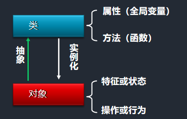
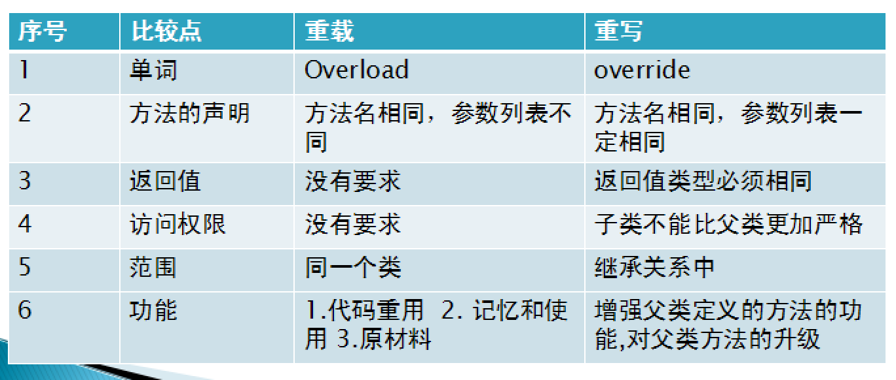
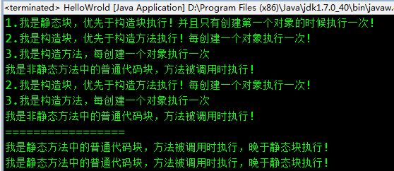

# 面向对象

​	OOP: Object Oriented Programming，面向对象程序设计.

​	所谓 “对象” 在显式支持面向对象的语言中，一般是指类在内存中装载的实例，具有相关的成员变量和成员函数（也称为：方法）。面向对象的程序设计完全不同于传统的面向过程程序设计，它大大地降低了软件开发的难度，使编程就像搭积木一样简单，是当今电脑编程的一股势不可挡的潮流。OOP 达到了软件工程的三个主要目标：**重用性、灵活性和扩展性**。为了实现整体运算，每个对象都能够接收信息、处理数据和向其它对象发送信息。

​	OOP 两个核心概念: 类和对象.

​	OOP 三大特性: 封装,继承,多态.


扩展资料：

​	OOP 的优点:使人们的编程与实际的世界更加接近，所有的对象被赋予属性和方法，结果编程就更加富有人性化。

​	OOP 的也有缺点，就 C++ 而言，由于面向更高的逻辑抽象层，使得 C++ 在实现的时候，不得不做出性能上面的牺牲，有时候甚至是致命的 ( 所有对象的属性都经过内置多重指针的间接引用是其性能损失的主要原因之一)。

​	在计算机速度飞速发展的今天，你可能会说，一丁点的性能牺牲没什么大不了。是的，从面向对象的角度，使的编程的结构更加清晰完整，数据更加独立和易于管理，性能的牺牲可以带来这么多的好处，没有理由不做稳赚的生意吧?

​	不过，在某些对速度要求极高特殊场合，例如你做的是电信的交换系统，每秒钟有超过百万的人同时进行电话交换，如果，每一个数据交换过程都是一个对象，那么总的性能损失将是天文数字!


## 一.类与对象

​	对象是Java程序的核心，在Java程序中"万事万物皆对象".

​	类描述了对象的属性和对象的行为，类是对象的模板，图纸。

​	对象是类的一个实例，是一个实实在在的个体 。

​	JDK提供了很多类供编程人员使用，编程人员也可以定义自己想要的类。



### 1.构造方法

```java
   构造方法 : 构造函数、构造器  -- 就是一个特殊的方法

   作用: 创建并初始化对象(即给 对象的属性赋初值)。

   声明要求：
      [修饰符] 方法名称(形参列表){
      }
      修饰符：  public ，protected， default， private
      方法名：  必须和类名完全一致
      返回值： 没有返回值， 也不能写void

   调用： 同new 关键字， 调用构造函数， 创建对象
   
   注意事项：
	如果一个类中， 没有显示构造函数的声明， 创建对象的时候， 会有编译器， 自动添加一个无参的构造函数。
	如果有显示的构造函数， 编译器则不会添加任何构造方法了， 空的构造方法需要自己写。
```

### 2.this

```java
 用法：
   1，用于指定是本类的对象， 可以访问本类的属性和方法
      在局部变量和全局变量重名的时候，用this关键字来区分，this作为对象，并且能够访问的只有成员变量
      this.name --- 成员变量的name
      name --- 局部变量name

   2，用于指代本类的构造函数，
      this 用于构造函数之间的调用， 注意： 必须要放在首行。
      如果类中有多个构造函数， this指代调用的是哪一个， 则需要通过参数来区分
```

### 3.static

​	static   关键字, 修饰符,表示静态的,属于类所有

3.1 属性： 成员变量

```
	如果一个成员变量， 用static 来修饰， 就表示这个变量属于类， 且仅有一份 静态的属性， 随着类的加载而加载； 非静态的属性， 随着对象的创建而参数

  	用法：什么样的属性需要通过static 来修饰？
		该类的所有对象都有该属性值， 都相同， 可以用static 来修饰
   		举例：  男人， 女人  类中， static sex 分别是相同的值
```

3.2 功能： 方法

​	 静态方法， 由类来调用，而非静态的方法， 是由对象来调用。

       注意：
         静态方法中， 不能访问非静态的成员变量和方法， 但是可以访问静态的。
         非静态的方法中， 静态和非静态的成员变量和方法都能访问。
         在静态的方法中， 不能出现this和super关键字


```java
  用法：
    当一个方法中， 不涉及到非静态的方法和属性， 也没有this关键字， 就可以声明为静态的方法	
	public class Demo {
        public static void main(String[] args){
           Demo.printMsg();
           new Demo().print();
        }

        public static void printMsg(){
           System.out.println("------");
        }
        public void print(){
           System.out.print("========");
        }
     }
```


## 二.特性

​	封装 (Encapsulation)
​	继承 (Inheritance)
​	多态 (Polymorphism)

### 1.封装

#### 1.什么是封装

​	封装：是指隐藏对象的属性和实现细节，仅对外提供公共访问方式。

#### 2.封装的分类与好处

```
	狭义的封装：属性的封装与方法的封装
	广义的封装：包的管理、组件、框架、应用程序...
	
	好处：
		将变化隔离
		提高重用性
		
		提高了数据的安全性
    		别人不能够通过 变量名.属性名 的方式来修改某个私有的成员属性(通过隐藏这些数据成员并强制和使用某个方法去设置或者改变这些特定的值，可以确保只设置合法的值)
		操作简单
    		封装后，多个调用者在使用的时候，只需调用方法即可，调用者不需要再进行判断
		隐藏了实现
   			实现过程对调用者是不可见的，调用者只需调用方法即可，不知道具体实现过程

	出于安全考虑,类中的属性， 可以被对象任意访问， 所有会造成数据的不安全。

	关键字： public --> private  仅限于本类访问

	java 中对于封装性， 大多都是针对属性的封装， 为了保护属性值的数据安全
```

#### 3.操作步骤

1.  在属性的前面的private， 意味着属性只能本类访问

2.  通过getXXX 和 setXXX方法， 进行取值和赋值

### 2.继承

#### 1.概念

```
	在java代码中， 继承是面向对象的第二大特征,即: 一个类(子类,扩展类)可以继承另一个类(父类,基类,超类)

	1.子类继承了父类， 可以使用父类的属性和方法， 但是父类不能访问子类新增的方法 （避免重复代码）
  	2.子类中可以新增自己的属性 和 方法 （扩展了父类的功能）
  	3.子类可以重写父类的方法（扩展了父类的功能）

	继承存在的意义和目的:
	1.避免重复的代码
	2.增强了程序的扩展性
```

#### 2.extends关键字

```java
	子类  extends 父类 {
  		//类中的内容
  	}
```

#### 3.继承的局限性 :  java 单继承

  	一个类只能有一个父类。

  	类只允许单继承,不允许多继承,允许多层继承

#### 4.重写

​	子类将父类的所有方法， 重新实现， 就叫做重写 (子类觉得父类的方法不好用,在它的基础上,调整一下).

```
  要求:
  	1.发生在继承关系中
 	2.子类中方法的声明， 必须要和父类的一致（返回值类型， 方法名， 参数列表） ---  如果不一致， 那么就是子类新增的方法
 	3.子类方法的修饰符， 不能比父类的严格
 	4.子类重写的方法，不能抛出比父类更大的异常
```

| 类型       | 要求                      |
| ---------- | ------------------------- |
| 修饰符     | 访问权限:不能比父类的严格 |
| 返回值类型 | 必须和父类一致            |
| 方法名     | 必须和父类一致            |
| 参数列表   | 必须和父类一致            |
| 异常       | 不能抛出比父类更大的异常  |

​	如果子类中， 存在了重写父类的方法， 那么子类的对象， 默认调用的是子类重写的方法


```java
      1，Student  类中 重写了父类 Person  的 eat（）
      s.eat() -- 调用了子类中重写的方法

      2， Employee 类 中 没有重写父类Person 类的eat（）
      e.eat() --  调用的父类中的方法
```

#### 5.override 重写和overload重载 的区别



#### 6.子类对象的创建过程

      任何子类的对象，都是先调用父类的构造函数，默认调用无参的构造函数，然后再调用子类的构造函数。
      子类也可以调用父类有参的构造函数

#### 7.super 关键字

        作用：
          1.用 super 来指定父类的构造函数
    
          super() : 父类无参的构造函数
          super(12,32): 父类有参的构造函数
          如果父类有参的构造函数有多个， 根据参数来决定
    
          this() 和 super() 不能同时出现在一个构造函数中?
          因为在构造的时候只需要调用父类的super()作为初始化父类一次，如果super(...)和this(...)同时出现的话，那么就会出现初始化父类两次的不安全操作，因为当super(...)和this(...)同时出现的时候，在调用完了super(..)之后还会执行this(..)，而this(...)中又会自动调用super（）,这就造成了调用两次super()的结果(这是假设super(...)和this(...)同时出现时候，super(...)在this(...)前面，反过来出现也一样)
    
          2.可以通过super 来访问父类的 属性和方法
          super.父类的属性
          super.父类的方法

####  8.final 关键字

​	修饰符,表示最终,终结的.


      	变量: 赋值一次， 就是一个常量
    	 	被final 修饰的变量名要大写，如果多个单词， 中间下划线隔开
    	 	final int ERROR_CODE = 1; 
      	方法：不能被重写
      	类：不能被继承   --- 太监类

#### 9.抽象类	

```
	关键字： abstract
	
	由来：
		抽象类就是不断向上抽取过程，在抽取的过程当中，子类的方法的声明相同，
        但是方法体不同，在抽取中，形成了没有方法体的方法，这个方法被称之为抽象方法，
        抽象方法所在的类被称之为抽象类，抽象方法和抽象类都需要通过
        关键字 abstract 来修饰。

	描述事物时没有给定具体的信息对事物进行描述， 那么这个类就是抽象类
	抽象类只描述了事物的行为， 没有具体描述的功能， 要通过子类特有的功能来描述
	一个类中如果有抽象的方法， 则这个类必须声明为抽象类
    如果一个类是抽象类，类中不一定有抽象的方法

    特点：
      1. 没有方法体的方法， 抽象方法一定在抽象类中
      2. 抽象类和抽象的方法必须要通过abstract来修饰
      3. 抽象类不能被实例化， 也就意味着他不能创建对象
      4. 抽象类要求他的子类必须要重写他的抽象方法

	问题：
      1. 抽象类一定是父类？
      是的， 因为抽象类没有足够的信息来描述事物， 所以需要依托子类对其进行具体化

      2. 抽象类有构造方法吗？
      有， 可以给子类的对象进行初始化

      3. 抽象类中可以不定义抽象方法吗？
      可以， 这个类存在的意义就是不让创建对象， java 底层代码中用到的比较多

      4. 抽象的关键字不能和那些关键字共存？
	  static ：
      原因：静态的,可以通过类名来直接调用,并且不能被重写,而抽象的是必须要重写,所以矛盾
	  private ：
      原因：私有的,不能被本类之外调用,也不能被重写,而抽象的是必须要重写,所以矛盾
	  final:
      原因：final 修饰的类,是不能被重写,而抽象的是必须要重写,所以矛盾

	抽象类和普通类的区别：
      相同：
      都是用来描述事物的,可以定义属性,方法,构造方法
      
      不同：
      1. 普通类中是不能定义抽象方法的， 而抽象类可以定义
      2. 普通类可以被实例化， 但是抽象类不可以
      3. 普通类中的方法可以不用重写， 但是抽象类中的抽象方法，必须要被重写的
```

#### 10.接口

    	接口    --- 比抽象类还要抽象的
    	类和类之间是继承的关系,类和接口之间是实现的关系。
    	一个类只能继承一个父类， 但是可以实现多个接口。
    	
    	接口的使用规范：
    	1、接口中可以定义常量，不能定义变量，如果你在接口中定义属性，那么通过反编译可以看见他会自动用public static final 修饰，接口中的属性都是全局静态常量，接口中的常量必须在定义时指定初始值。
    	2、接口中所有的方法都是抽象方法，接口中方法都会自动用public abstract 修饰，即接口中只有全局抽象方法。
    	3、接口不能实例化，接口中不能有构造。
    	4、接口之间可以通过extends实现继承关系，一个接口可以继承多个接口，但接口不能继承类。
    	5、接口的实现类必须实现接口的全部方法，否则必须定义为抽象类。
    	
    	关键字：
    		interface  定义接口
          	implements  实现接口
    
        接口的定义格式：
            interface 接口名(){
               接口的内容；
            }
    	
    	接口的特点：
    		1. 接口使用interface 来定义
    		2. 接口中的成员的修饰符有固定的， 需要使用public 来修饰
    		3. 接口不能被实例化
    		4. 接口必须由他的实现类来重写所有的方法
    
    	接口的好处：
    		1.接口可以多实现     ---  理解为java 改良后的多继承
    		2.定义接口有利于代码的规范
    		3.有利于对代码进行维护
    		4.保证代码的安全和严密
    		5.降低耦合
    
    	接口和抽象类：
    		1. 抽象类是用于继承的， 而且是单继承
    		   接口是用来实现的， 而且可以多实现
    		
    		2. 抽象类中可以定义非抽象的内容， 可以直接提供给子类去使用
    		   接口中全部都是抽象的方法， 必须由实现类来全部实现
    
    		3. 抽象类的存在是继承的关系， 是 is - a关系
    		   接口存在着实现的关系， 是 like a 的关系
    		   相同点： 都是不断的向上抽取的
### 3. 多态

#### 1. 概念

​	父类引用指向子类对象

​	同一操作作用于不同的对象，可以有不同的解释，产生不同的执行结果，这就是多态性。简单的说:就是用基类的引用指向子类的对象
​      	多态是同一个行为具有多个不同表现形式或形态的能力.
​	多态就是同一个接口，使用不同的实例而执行不同操作.

​	前提： 必须是继承的关系

#### 2. 多态存在的三个必要条件:

1.	 继承
2.	 重写
3.	 父类引用指向子类对象(向上转型)	

#### 3. 多态的实现方式

1.  重写
2.  接口
3. 抽象类和抽象方法

#### 4. 好处： 提高了代码的重用性

1.  应用程序不必为每一个派生类编写功能调用，只需要对抽象基类进行处理即可。大大提高程序的可复用性。//继承 
2.  派生类的功能可以被基类的方法或引用变量所调用，这叫向后兼容，可以提高可扩充性和可维护性。 //多态的真正作用

#### 5. 多态使用

```
	  一个对象的多种形态
      子类对象， 既可以作为父类的对象， 由父类来引用；
      也可以作为子类的对象， 由子类来引用；
      
      父类的引用： 向上的转型（失去了子类新增的， 父类的内容， 包括重写的方法）
      子类的引用： 向下的转型（可以调用父类的， 可以调用子类重写的和新增）
      
	  最后为什么我们要用到向上转型？
      目的是规范和扩展，提高了代码的维护性和扩展性

      instanceof ： 用于判断一个对象， 是否是一个类的引用
      如果对象向下转型， 那么必须要判断对象的类型
      如果不判断， 可能会出现类型转化的异常

      父类： A -- i, j , test1() , test2()
      子类:  B -- k, test2(), test3()

      A a2 = new B();向上转型
      B  b = new B(); // 1,执行父类A 的构造方法 ； 2， 执行子类B 的构造方法
      b: 包含 A 类的属性， B 类的属性 ---》 B extends A
      A a2 =  b;
      A 受到父类身份的限制：  只能访问父类自己的方法 和  属性

      B  b2 = (B)a2; 向下转型
      B 子类，  -- 可以方法父类和子类 这两个类的属性和方法
```


## 三.代码块


​	在java中用{}括起来的称为代码块，代码块可分为以下四种：

### 1.四种代码块简介

​	**1.普通代码块：**

​		类中方法的方法体

​	**2.构造代码块**：

​		构造块会在创建对象时被调用，每次创建时都会被调用，优先于类构造函数执行。

​	**3.静态代码块：**

​		用static{}包裹起来的代码片段，只会执行一次。静态代码块优先于构造块执行。

​	**4.同步代码块：**

​		使用synchronized（）{}包裹起来的代码块，在多线程环境下，对共享数据的读写操作是需要互斥进行的，否则会导致数据的不一致性。同步代码块需要写在方法中。

### 2.静态代码块和构造代码块的异同点

​	相同点：都是JVM加载类后且在构造函数执行之前执行，在类中可定义多个，一般在代码块中对一些static变量进行赋值。

​	不同点：静态代码块在非静态代码块之前执行。静态代码块只在第一次new时执行一次，之后不在执行。而非静态代码块每new一次就执行一次。

### 3.示例

普通代码块：

​	在方法或语句中出现的{}就称为普通代码块。普通代码块和一般语句的执行顺序由他们在代码中出现的次序决定，先出现先执行。

```java
    public class Test { 

      public static void main(String[] args) { 
          
        { 
          int x = 3; 
          System.out.println("普通代码块内的变量x=" + x); 
        } 
          
        int x = 1; 
        System.out.println("主方法内的变量x=" + x); 
          
        { 
          int y = 7; 
          System.out.println("普通代码块内的变量y=" + y); 
        } 
          
      } 
    } 
    /* 
     * 运行结果  普通代码块内的变量x=3 
     *      主方法内的变量x=1 
     *      普通代码块内的变量y=7 
     */
```

构造代码块：

​	直接在类中定义且没有加static关键字的代码块称为{}构造代码块。构造代码块在创建对象时被调用，每次创建对象都会被调用，并且构造代码块的执行次序优先于类构造函数。如果存在多个构造代码块，执行顺序由他们在代码中出现的次序决定，先出现先执行。

```java
public class Test1 {
    
    {
        System.out.println("第一构造块");
    }
    
    public Test1(int i) {
        System.out.println("第" + i + "次调用" + "构造方法");
    }
    
    {
        System.out.println("第二构造块");
    }
    
    public static void main(String[] args) {
        new Test1(0);
        new Test1(1);
        new Test1(2);
    }
}
/* 
 * 执行结果 
 *		第一构造块 
 *      第二构造块 
 *      第0次调用构造方法 
 *      第一构造块 
 *      第二构造块 
 *      第1次调用构造方法 
 *      第一构造块 
 *      第二构造块 
 *      第2次调用构造方法 
 */
```

静态代码块:

​	在java中使用static关键字声明的代码块。静态块用于初始化类，为类的属性初始化。每个静态代码块只会执行一次。由于JVM在加载类时会执行静态代码块，所以静态代码块先于主方法执行。

​	如果类中包含多个静态代码块，那么将按照"先定义的代码先执行，后定义的代码后执行"。

**注意：**

​	1. 静态代码块不能存在于任何方法体内。

​	2. 静态代码块不能直接访问实例变量和实例方法，需要通过类的实例对象来访问。

```java
    public class Test3 {

        public static String STATIC_FIELD = "静态属性";

        // 静态块 
        static {
            System.out.println(STATIC_FIELD);
            System.out.println("静态代码块1");
        }
        public String field = "非静态属性";

        // 非静态块 
        {
            System.out.println(field);
            System.out.println("非静态代码块1");
        }

        public InitOderTest() {
            System.out.println("无参构造函数");
        }

        public static void main(String[] args) {
            InitOderTest test = new InitOderTest();
        }

        // 非静态块 
        {
            System.out.println(field);
            System.out.println("非静态代码块2");
        }

        // 静态块 
        static {
            System.out.println(STATIC_FIELD);
            System.out.println("静态代码块2");
        }
    }
    /* 
     * 运行结果 静态属性 
     *      静态代码块1 
     *      静态属性 
     *      静态代码块2 
     *      非静态属性 
     *      非静态代码块1 
     *      非静态属性 
     *      非静态代码块2 
     *      无参构造函数 
     */
```

​	以下代码演示了创建一个对象并调用方法各个代码块之间的优先关系：

```java
public class Person {
    
    static{
        System.out.println("1.我是静态块，优先于构造块执行！并且只有创建第一个对象的时候执行一次！");
    }
    
    {
        System.out.println("2.我是构造块，优先于构造方法执行！每创建一个对象执行一次！");
    }
    
    public Person() {
        System.out.println("3.我是构造方法，每创建一个对象执行一次");
    }
    
    public void function1(){
        System.out.println("我是非静态方法中的普通代码块，方法被调用时执行！");
    }
    
    public static void function2(){
        System.out.println("我是静态方法中的普通代码块，方法被调用时执行，晚于静态块执行！");
    }
}
```

​	测试类：

```java
    public class HelloWrold {
        public static void main(String[] args) {
            new Person().function1();
            new Person().function1();
            System.out.println("=================");
            Person.function2();
            Person.function2();
        }
    }
```

​	运行结果：



​	我们可以看出：静态块总是最先执行的，并且只有在创建该类的第一个实例的时候才会执行一次；第二执行的是构造块；第三执行的是构造方法。


## 四.内部类

​	在Java中，可以将一个类定义在另一个类里面或者一个方法里面，这样的类称为内部类。广泛意义上的内部类一般来说包括这四种：成员内部类、局部内部类、匿名内部类和静态内部类。下面就先来了解一下这四种内部类的用法。

### 1.成员内部类

　　成员内部类是最普通的内部类，它的定义为位于另一个类的内部，形如下面的形式：

```java
    class Circle {
        double radius = 0;

        public Circle(double radius) {
            this.radius = radius;
        }

        class Draw {     //内部类
            public void drawSahpe() {
                System.out.println("drawshape");
            }
        }
    }
```

　　这样看起来，类Draw像是类Circle的一个成员，Circle称为外部类。成员内部类可以无条件访问外部类的所有成员属性和成员方法（包括private成员和静态成员）。

```java
    class Circle {

        private double radius = 0;

        public static int count =1;

        public Circle(double radius) {
            this.radius = radius;
        }

        class Draw {     //内部类
            public void drawSahpe() {
                System.out.println(radius);  //外部类的private成员
                System.out.println(count);   //外部类的静态成员
            }
        }
    }
```

　　不过要注意的是，当成员内部类拥有和外部类同名的成员变量或者方法时，会发生隐藏现象，即默认情况下访问的是成员内部类的成员。如果要访问外部类的同名成员，需要以下面的形式进行访问：

```java
    外部类.this.成员变量
    外部类.this.成员方法
```

　　虽然成员内部类可以无条件地访问外部类的成员，而外部类想访问成员内部类的成员却不是这么随心所欲了。在外部类中如果要访问成员内部类的成员，必须先创建一个成员内部类的对象，再通过指向这个对象的引用来访问：

```java
    class Circle {
        private double radius = 0;

        public Circle(double radius) {
            this.radius = radius;
            getDrawInstance().drawSahpe();   //必须先创建成员内部类的对象，再进行访问
        }

        private Draw getDrawInstance() {
            return new Draw();
        }

        class Draw {     //内部类
            public void drawSahpe() {
                System.out.println(radius);  //外部类的private成员
            }
        }
    }
```

　　成员内部类是依附外部类而存在的，也就是说，如果要创建成员内部类的对象，前提是必须存在一个外部类的对象。创建成员内部类对象的一般方式如下：

```java
    public class Test {
        public static void main(String[] args)  {
            //第一种方式：
            Outter outter = new Outter();
            Outter.Inner inner = outter.new Inner();  //必须通过Outter对象来创建

            //第二种方式：
            Outter.Inner inner1 = outter.getInnerInstance();
        }
    }

    class Outter {
        
        private Inner inner = null;
        public Outter() {

        }
        public Inner getInnerInstance() {
            if(inner == null)
                inner = new Inner();
            return inner;
        }

        class Inner {
            public Inner() {
            }
        }
    }
```

　　内部类可以拥有private访问权限、protected访问权限、public访问权限及包访问权限。比如上面的例子，如果成员内部类Inner用private修饰，则只能在外部类的内部访问，如果用public修饰，则任何地方都能访问；如果用protected修饰，则只能在同一个包下或者继承外部类的情况下访问；如果是默认访问权限，则只能在同一个包下访问。这一点和外部类有一点不一样，外部类只能被public和包访问两种权限修饰。我个人是这么理解的，由于成员内部类看起来像是外部类的一个成员，所以可以像类的成员一样拥有多种权限修饰。

### 2.局部内部类

　　局部内部类是定义在一个方法或者一个作用域里面的类，它和成员内部类的区别在于局部内部类的访问仅限于方法内或者该作用域内。

```java
    class People{
        public People() {

        }
    }

    class Man{
        public Man(){

        }

        public People getWoman(){
            class Woman extends People{   //局部内部类
                int age =0;
            }
            return new Woman();
        }
    }
```

　　注意，局部内部类就像是方法里面的一个局部变量一样，是不能有public、protected、private以及static修饰符的。

### 3.匿名内部类

　　匿名内部类应该是平时我们编写代码时用得最多的，在编写事件监听的代码时使用匿名内部类不但方便，而且使代码更加容易维护。下面这段代码是一段Android事件监听代码：

```java
	scan_bt.setOnClickListener(new OnClickListener() {
             
		@Override
		public void onClick(View v) {
        	// TODO Auto-generated method stub
        }
	});
         
	history_bt.setOnClickListener(new OnClickListener() {
             
		@Override
        public void onClick(View v) {
        	// TODO Auto-generated method stub
                 
        }
	});
```

　　这段代码为两个按钮设置监听器，这里面就使用了匿名内部类。这段代码中的：

```java
	new OnClickListener() {
		@Override
        public void onClick(View v) {
        	// TODO Auto-generated method stub
                 
        }
	}
```

　　就是匿名内部类的使用。代码中需要给按钮设置监听器对象，使用匿名内部类能够在实现父类或者接口中的方法情况下同时产生一个相应的对象，但是前提是这个父类或者接口必须先存在才能这样使用。当然像下面这种写法也是可以的，跟上面使用匿名内部类达到效果相同。

```java
    private void setListener(){
        scan_bt.setOnClickListener(new Listener1());       
        history_bt.setOnClickListener(new Listener2());
    }

    class Listener1 implements View.OnClickListener{
        @Override
        public void onClick(View v) {
        // TODO Auto-generated method stub

        }
    }

    class Listener2 implements View.OnClickListener{
        @Override
        public void onClick(View v) {
        // TODO Auto-generated method stub

        }
    }
```

　　这种写法虽然能达到一样的效果，但是既冗长又难以维护，所以一般使用匿名内部类的方法来编写事件监听代码。同样的，匿名内部类也是不能有访问修饰符和static修饰符的。

　　匿名内部类是唯一一种没有构造器的类。正因为其没有构造器，所以匿名内部类的使用范围非常有限，大部分匿名内部类用于接口回调。匿名内部类在编译的时候由系统自动起名为Outter$1.class。一般来说，匿名内部类用于继承其他类或是实现接口，并不需要增加额外的方法，只是对继承方法的实现或是重写。

### 4.静态内部类

　　静态内部类也是定义在另一个类里面的类，只不过在类的前面多了一个关键字static。静态内部类是不需要依赖于外部类的，这点和类的静态成员属性有点类似，并且它不能使用外部类的非static成员变量或者方法，这点很好理解，因为在没有外部类的对象的情况下，可以创建静态内部类的对象，如果允许访问外部类的非static成员就会产生矛盾，因为外部类的非static成员必须依附于具体的对象。

```java
    public class Test {
        public static void main(String[] args)  {
            Outter.Inner inner = new Outter.Inner();
        }
    }

    class Outter {
        public Outter() {

        }

        static class Inner {
            public Inner() {

            }
        }
    }
```