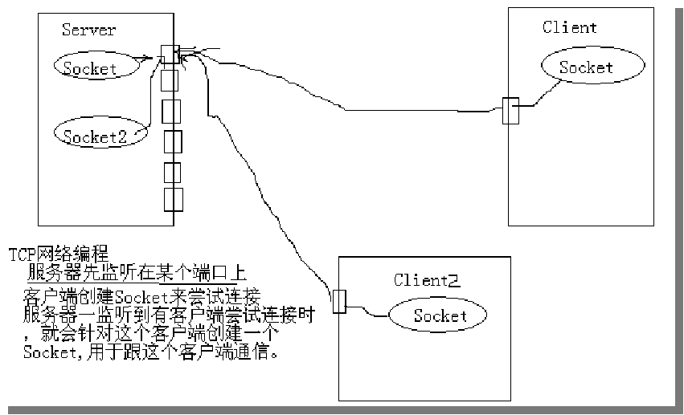
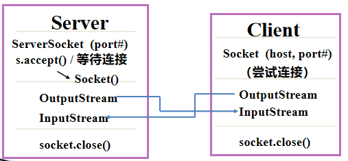

# 网络编程

## 一.TCP与UDP

### 1.什么是计算机网络

​	把分布在不同地理区域的计算机与专门的外部设备用通信线路互连成一个规模大、功能强的网络系统，从而使众多的计算机可以方便地互相传递信息，共享硬件、软件、数据信息等资源。

### 2.网络通信协议

​	要使计算机连成的网络能够互通信息，需要对数据传输速率、传输代码、代码结构、传输控制步骤、出错控制等制定一组标准，这一组共同遵守的通信标准就是网络通信协议，不同的计算机之间必须使用相同的通讯协议才能进行通信。

​	在Internet中TCP/IP协议是使用最为广泛的通讯协议。TCP/IP是英文Transmission Control Protocol/Internet Protocol的缩写，意思是“传输控制协议/网际协议”。

TCP/IP协议:
​	TCP/IP实际上是一组协议，它包括上百个各种功能的协议，如：远程登录、文件传输等，而TCP协议和IP协议是保证数据完整传输的两个基本的重要协议。通常说TCP/IP是Internet协议族，而不单单只是指TCP协议和IP协议。
​	TCP/IP协议的基本传输单位是数据包（datagram）。

​	TCP是一种面向连接的通信协议。TCP连接提供两台计算机之间的可靠无差错的字节流数据传输。

### 3.IP地址和端口号

​    1. IP地址

​	IP地址：网络中每台计算机的一个标识号, 是一个逻辑地址

​	在实际中可以使用127.0.0.1表示本机，或者直接使用localhost代表本机。

​	IP地址使用32位长度二进制数据表示，一般在实际中看到的大部分IP地址都是以十进制的数据形式表示的，如：192.168.1.3。

​	IP地址分类：
​	IP地址分为5类，A类保留给政府机构，B类分配给中等规模的公司，C类分配给任何需要的人，D类用于组播，E类用于实验，各类可容纳的地址数据不同

| NO.  | 地址分类 | 地址范围                   |
| ---- | -------- | -------------------------- |
| 1    | A类地址  | 1.0.0.1——126.255.255.254   |
| 2    | B类地址  | 128.0.0.1——191.255.255.254 |
| 3    | C类地址  | 192.0.0.1——223.255.255.254 |
| 4    | D类地址  | 244.0.0.1——239.255.255.254 |
| 5    | E类地址  | 240.0.0.1——255.255.255.254 |

​    2. 端口号

​	端口号：具有网络功能的应用软件的标识号

​	端口是一个软件结构，被客户程序或服务程序用来发送和接收数据，一台服务器有256*256个端口。
​	0-1023是公认端口号，即已经公认定义或为将要公认定义的软件保留的
​	1024-65535是并没有公共定义的端口号，用户可以自己定义这些端口的作用。

​	端口与协议有关：TCP和UDP的端口互不相干

### 4.Socket

​	两个应用程序可以通过一个双向的网络通信连接实现数据交换，这个双向链路的一端称为一个Socket。

​	Socket可以看成在两个程序进行通讯连接中的一个端点，一个程序将一段信息写入Socket中，该Socket将这段信息发送给另外一个Socket中，使这段信息能传送到其他程序中。

​	Socket通常用来实现client-server连接，建立连接时所需的寻址信息为远程计算机的IP地址和端口号(Port Number)	

#### 1、TCP Socket通信模型

​	java.net包中定义了两个类：Socket和ServerSocket，分别用来实现TCP的client和server端。	

```java
网络编程的四个基本步骤
创建socket;
打开连接到socket的输入/输出流；
按照一定的协议对socket进行读/写操作；
关闭socket;

TCP示例1
//TCP Server
public class TCPServer { 
    public static void main(String[] args) {
        try {
            ServerSocket s = new ServerSocket(8888);
            while (true) {
                Socket s1 = s.accept();
                BufferedWriter bw = new BufferedWriter(new OutputStreamWriter(s1.getOutputStream()));
                bw.write("你好, " +s1.getInetAddress()+ ":" + s1.getPort());
                bw.close();
                s1.close();
            }
        } catch (IOException e) {
            e.printStackTrace();
            System.out.println("程序运行出错:" + e);
        }
    }
}

//TCP Client
public class TCPClient { 
    public static void main(String[] args) {
        try {
            Socket s = new Socket("127.0.0.1", 8888);
            BufferedReader br = new BufferedReader(new InputStreamReader(s.getInputStream()));
            String str = br.readLine();
            System.out.println("服务器说:" + str);
        } catch (UnknownHostException e) {
            System.err.println("服务器连接失败！");
            e.printStackTrace();
        } catch (IOException e) {
            e.printStackTrace();
        }
    }
}


//TCP 聊天示例
public class TalkServer {
    public static void main(String[] args) {
        try {
           ServerSocket s = new ServerSocket(9999);
           Socket s1 = s.accept();
           PrintWriter pw = new PrintWriter(new OutputStreamWriter(s1.getOutputStream()),true);
           BufferedReader br = new BufferedReader(new InputStreamReader(s1.getInputStream()));
           BufferedReader toClientBr = new BufferedReader(new InputStreamReader(System.in));
           System.out.println("客户端来了!!!");
           System.out.println("客户端说:" + br.readLine());
           String str = null;
           while (!(str = toClientBr.readLine()).equals("exit")) {
               //向客户端写话
               pw.println(str);               
               pw.flush();
               System.out.println("客户端说:" + br.readLine());
           }
           toClientBr.close();           
           pw.close();           
           s1.close();
        } catch (IOException e) {
           e.printStackTrace();            
           System.out.println("程序运行出错:" + e);
        }
   }
}
```

#### 2、UDPSocket通信模型

​	TCP /IP中的协议: UDP(User Datagram Protocol)用户数据包协议
​	UDP和TCP位于同一层-传输层，但它对于数据包的顺序错误或重发没有TCP来的可靠。因此，UDP不被应用于那些使用虚电路的面向直接服务，UDP主要用于面向查询--应答的服务。
​	UDP是一种面向无连接的通信协议。UDP向应用程序提供了一种发送封装的原始IP数据报的方法，并且发送时无需建立连接，不保证可靠数据的传输。

​	面向无连接的数据传输，不可靠的，但效率高 (发送音频、视频…)
​	UDP一次发送的数据不能超过64KB.

```java
UDP编程所需要的类
DatagramSocket 此类表示用来发送和接收数据报包的套接字
DatagramPacket 此类表示数据报包
DatagramPacket(byte[] buf, int length, InetAddress address, int port)
buf - 包数据
length - 包长度
address - 目的地址
port - 目的端口号

import java.io.IOException;
import java.net.*;
//发送端
public class UDPSender {
    public static void main(String[] args) {
        String str = "hello";
        DatagramSocket ds = null;
        DatagramPacket dp = null;
        try {
            //定义一个发包的Socket,端口使用9999
            ds = new DatagramSocket(9999);
            //要发送的数据包,一定要指定目的地IP和端口号
            dp = new DatagramPacket(str.getBytes(), 0,str.getBytes().length, new InetSocketAddress("127.0.0.1", 5555));
            //发送数据
           ds.send(dp);
        } catch (SocketException e) {        
        	e.printStackTrace();
        } catch (IOException e) {        
        	e.printStackTrace();
        }finally{
            if(dp != null){        
            	ds.close();
            }
        }
    }
}

import java.io.IOException;
import java.net.*;
//接收端
public class UDPReceiver {
    public static void main(String[] args) {
        byte buf[] = new byte[1024];
        DatagramPacket dp = new DatagramPacket(buf, buf.length);
        DatagramSocket ds = null;
        try {
            //建立一个收包的socket,监听在5555端口
            ds = new DatagramSocket(5555);
            while(true){
                //收数据--此方法在接收到数据报前一直阻塞
                ds.receive(dp);
                System.out.println(new String(buf, 0, dp.getLength()));
            }
        } catch (SocketException e) {
        	e.printStackTrace();
        } catch (IOException e) {
        	e.printStackTrace();
        } finally {
            if (null != ds) {
            	ds.close(); 
            }
        }
    }
}
```








## 二.http协议

### 1.http协议

​	超文本传输协议 Hyper Text Transfer	Protocol 的简写
 * Http 协议是基于TCP协议之上的
   有时TCP协议上有 TLS, SSL 协议， 如果包含这两种协议， 我们称之为 HTTPS 协议
 * Http 协议是应用层的协议， 由请求和响应两个部分组成， 是一个标准的客户端服务器的模型
   Http协议是无状态的协议
   Http请求永远都是客户端发送请求， 服务器端做出响应
 * Http就是访问网络
 * 获取网络数据：
   ​图片， 音频， 视频， 压缩文件， json字符串， xml...
 * 注意：
   Http协议是传输数据的短连接， 服务器返回数据后就会断开连接
   TCP 协议时传输数据的长连接， 如果不手动断开连接， 会一直保持连接状态

### 2.HttpURLConnection

​	java 中对于http 请求数据的封装类: java 原生自带  HttpURLConnection

​	Http：网络协议
​	URL	：统一资源定位符
​	Connection ： 连接
​	返回码信息： http://blog.csdn.net/it_man/article/details/50235315	

  步骤：

```java

	GET请求：
		1， 得到URL 对象
			URL url= new URL(path);
		2， 通过URL 对象 打开连接 HttpURLConnection
		3， 设置参数 (可以不写)
		4， 连接
		5， 判断连接是否成功 -- 获取服务器的响应码
		6， 获取输入流，
		7， 操作数据
		8， 关闭流

	POST请求：
		1， 得到URL 对象
		2， 通过URL 对象 打开连接 HttpURLConnection
		3， 设置参数
			conn.setRequestMethod("POST");
			conn.setDoOutput(true);
		4， 连接
		5， 获取连接的输出流， 写入参数
			OutputStream os = conn.getOutputStream();
			os.write("参数信息".getBytes());
			os.flush();
		6， 判断连接是否成功 -- 获取服务器的响应码
		7， 获取输入流，
		8， 操作数据
		9， 关闭流
```

实例一：  从网上下载图片， 保持到本地磁盘中  GET

```java
//从网络下载图片， 并且保存到本地磁盘中
public class Demo01_HttpURLConnection {
	public static void main(String[] args) {
		HttpURLConnection conn =null;
		FileOutputStream fos = null;
		String path = "http://images.haiwainet.cn/20151127/1448607631915984.png";
		try {
			//1, 获取URL对象
			URL url = new URL(path);
			//2, 根据URL 对象， 打开HttpURLConnection 连接对象
			conn = (HttpURLConnection) url.openConnection();
			//3, 设置基本参数
			conn.setRequestMethod("GET");	//设置本次请求的方式 ， 默认是GET方式， 参数要求都是大写字母
			conn.setConnectTimeout(5000);//设置连接超时
			conn.setDoInput(true);//是否打开输入流 ， 此方法默认为true
			conn.setDoOutput(true);//是否打开输出流， 此方法默认为false
			conn.connect();//表示连接
			//4, 判断请求是否成功  -- 获取服务器的响应码
			int code = conn.getResponseCode();
			System.out.println("code = " + code);
			if (code == 200) {
				//5, 获取数据  -- 获取输入流  --  从流中读取数据
				InputStream  is = conn.getInputStream();
				String name = path.substring(path.lastIndexOf("/")+1);
				System.out.println("name = " + name);
			    fos = new FileOutputStream("C:\\pro\\"+name);
				byte[] buffer = new byte[1024];
				int len = 0;
				while ((len = is.read(buffer))!=-1) {
					fos.write(buffer, 0, len);
				}
				System.out.println("下载图片完成");
			}
		} catch (MalformedURLException e) {
			e.printStackTrace();
		}
		catch(IOException e){
			e.printStackTrace();
		}
		finally {
			if (conn!=null) {
				conn.disconnect();//断开连接
			}
			if (fos!=null) {
				try {
					fos.close();
				} catch (IOException e) {
					e.printStackTrace();
				}
			}
		}
	}
}
```

实例二：  从网上下载String  GET

```java
//根据地址， 获取字符串
public class Demo02_HttpURLConnection {
	public static void main(String[] args) throws MalformedURLException,IOException {
		String path = "http://m2.qiushibaike.com/article/list/suggest?page=1";
		ByteArrayOutputStream baos   = null;
		//1, 获取URL对象
		URL url = new URL(path);
		//2, 通过URL对象， 打开连接 HttpURLConnection
		HttpURLConnection conn = (HttpURLConnection) url.openConnection();
		//3, 设置请求参数
		conn.setRequestMethod("GET");
		conn.setConnectTimeout(5000);
		//4,  设置连接
		conn.connect();
		//5, 判断是否连接成功
		if(conn.getResponseCode() == 200){
		//if (conn.getResponseCode() == HttpURLConnection.HTTP_OK) {
			//6, 获取输入流， 从流获取数据
			InputStream is = conn.getInputStream();
			baos  = new ByteArrayOutputStream();
			byte[] buffer = new byte[1024];
			int len = 0;
			while ((len = is.read(buffer))!=-1) {
				baos.write(buffer, 0, len);
			}
			//7, 处理数据 --打印信息，解析 json, 解析 xml
			String result = baos.toString();
			System.out.println("result = " + result);
		}
	}
}
```

实例三：  从网上下载字符串， POST

```java
//通过POST方式请求数据
public class Demo03_HttpURLConnection {
	public static void main(String[] args) throws Exception{
		String path = "http://www.moviebase.cn/uread/app/splash/splashList";
		//1, 得到URL对象
		URL url = new URL(path);
		//2, 通过url对象打开链接
		HttpURLConnection conn = (HttpURLConnection) url.openConnection();
		//3, 设置参数
		conn.setRequestMethod("POST");
		conn.setDoOutput(true);//设置是否打开输出流
		//4, 连接
		conn.connect();
		//5, 获取输出流， 向输出流中写入参数
		OutputStream os = conn.getOutputStream();
		os.write("platform=2&appVersion=1.7.0&osType=2".getBytes());
		os.flush();
		//6, 判断请求结果
		if (conn.getResponseCode() == 200) {
			//7, 获取输入流， 取到信息
			InputStream is = conn.getInputStream();
			//8, 处理数据
			byte[] buffer = new byte[1024];
			int len= 0;
			while ((len = is.read(buffer))!=-1) {
				String str = new String(buffer, 0,len);
				System.out.print(str);
			}
		}
	}
}
```

实例四：  封装工具类

```java
//Http 请求的工具类
public class HttpUtils {
	/**
	 * GET
	 * 通过HttpURLConnection 类 向服务器获取数据
	 * @param path 路径
	 * @return byte[] 返回服务器的响应数据
	 */
	public static byte[] getByteArray(String path){
		ByteArrayOutputStream baos = null;
		try {
			URL url = new URL(path);
			HttpURLConnection connection = (HttpURLConnection) url.openConnection();
			connection.setRequestMethod("GET");
			connection.setConnectTimeout(5000);
			connection.connect();
			if(connection.getResponseCode() == 200){
				InputStream is  = connection.getInputStream();
				 baos = new ByteArrayOutputStream();
				 byte[] buffer = new byte[1024];
				 int len = 0;
				 while ((len = is.read(buffer))!=-1) {
					 baos.write(buffer, 0, len);
				}
				 return baos.toByteArray();
			}
		} catch (Exception e) {
		}
		return null;
	}
}
```


### 3.HttpClient

​	Apache 公司提供的第三方的框架  HttpClient

步骤:

```java
	GET
		1, 导包
		2, 创建HttpClient 对象
			HttpClient client = new DefaultHttpClient();
		3, 获取请求方式对象  
			HttpGet httpGet = new HttpGet(path);
		4, 设置请求方式, 发起请求, 获取响应对象
			HttpResponse response = client.execute(httpGet);
		5, 判断连接是否成功
			if(response.getStatusLine().getStatusCode() == 200){
		6, 获取响应的实体
					HttpEntity entity  = response.getEntity();
		7, 获取响应实体中的流
					InputStream is = entity.getContent();
		8, 操作数据
			}
			
	POST
		1, 导包
		2, 创建HttpClient 对象
			HttpClient client = new DefaultHttpClient();
		3, 获取请求方式对象
			HttpPost httpPost  = new HttpPost(path);
		4, 创建一个提交数据的容器
			List<BasicNameValuePair> params = new ArrayList<>();
			params.add(new BasicNameValuePar(“参数名称”,“参数内容”));
			params.add(new BasicNameValuePar(“参数名称”,“参数内容”));
		5, 封装容器到请求参数中
			HttpEntity entity  = new UrlEncodedFromEntity(params);
		6, 设置请求参数给post
			httpPost.setEntity(entity);
		7, 设置请求方式, 发起请求, 获取响应对象
			HttpResponse response = client.execute(httpPost);
		8, 判断连接是否成功
			if(response.getStatusLine().getStatusCode() == 200){
		9, 获取响应的实体
				HttpEntity httpEntity  = response.getEntity();
		10, 获取响应实体中的流
				InputStream is = httpEntity.getContent();
			}
```

示例一:通过HttpClient 向网络获取图片， 并且保存 

```java
/** 1, 导包
 * 		在项目中创建libs 文件夹， 将需要的jar包保存到libs文件夹中， 
 * 		然后选中所有的jar包， 右键 Build Path， 然后点击 add to build path
 */
public class Demo05_HttpClient {
	public static void main(String[] args) {
		String path = "https://timgsa.baidu.com/timg?image&quality=80&size=b9999_10000&sec=1502873544748&di=747e393c510a3980c78d54d8f11bc05b&imgtype=0&src=http%3A%2F%2Fuploadfile.bizhizu.cn%2F2015%2F0516%2F20150516034526291.jpg";
		//1, 导包
		//2, 创建HttpClient 对象
		HttpClient client = new DefaultHttpClient();		
		//3, 获取请求方式的对象
		HttpGet httpGet = new HttpGet(path);
		//4, 设置请求方式， 发起请求， 获取响应对象
		try {
			HttpResponse response = client.execute(httpGet);
			//5, 判断请求是否成功
			if (response.getStatusLine().getStatusCode() == 200) {
				//6, 获取响应内容 -- 实体
				HttpEntity entity = response.getEntity();
//				//7, 从实体中获取流
//				InputStream is = entity.getContent();
//				//8, 操作数据
//				byte[] buffer = new byte[1024];
//				int len = 0;
//				FileOutputStream fos = new FileOutputStream("C:\\abc.jpg");
//				while ((len = is.read(buffer))!=-1) {
//					fos.write(buffer, 0, len);
//				}
				byte[] data = EntityUtils.toByteArray(entity);
				DiskSaveHelper.saveFileToDisk(data, "a.jpg", "C:\\");
				System.out.println("下载保存图片完成");
			}
		} catch (ClientProtocolException e) {
			e.printStackTrace();
		} catch (IOException e) {
			e.printStackTrace();
		}
	}
}

//保存文件到本地磁盘中
public class DiskSaveHelper {
	/**
	 * @param data		写入的数据
	 * @param fileName  文件的名称
	 * @param diskPath  保存的路径
	 * @return
	 * 	  true	保存成功
	 * 	  false 保存失败
	 */
	public static boolean saveFileToDisk(byte[] data,String fileName,String diskPath){
		BufferedOutputStream bos = null; 
		try {
			bos = new BufferedOutputStream(new FileOutputStream(new File(diskPath, fileName)));
			bos.write(data, 0, data.length);
			bos.flush();
			return true;
		} catch (Exception e) {
		}
		finally{
			if (bos!=null) {
				try {
					bos.close();
				} catch (IOException e) {
					e.printStackTrace();
				}
			}
		}
		return false;
	}
}
```

实例二:通过HttpClient 获取String

```java
public class Demo06_HttpClient {
	public static void main(String[] args) throws Exception {
		String path = "http://m2.qiushibaike.com/article/list/suggest?page=1";
		//1, 导包
		//2, 创建HttpClient 对象
		HttpClient client = new DefaultHttpClient();
		//3, 获取请求方式对象
		HttpGet httpGet = new HttpGet(path);
		//4, 设置请求方式, 发起请求, 获取响应对象
		HttpResponse response = client.execute(httpGet);
		//5, 判断连接是否成功
		if(response.getStatusLine().getStatusCode() == 200){
			//6, 获取响应的实体
			HttpEntity entity = response.getEntity();
			//7, 获取内容--String
			String str = EntityUtils.toString(entity);
			System.out.println(str);
		}
	}
}
```

示例三:通过HttpPost 请求数据

```java
public class Demo07_HttpClient {
	public static void main(String[] args) throws Exception{
		String path = "http://www.moviebase.cn/uread/app/splash/splashList";
		//?platform=2&appVersion=1.7.0&osType=2
		
		//1, 导包
		//2, 创建HttpClient 对象
		HttpClient client = new DefaultHttpClient();
		//3, 获取请求的方式对象
		HttpPost httpPost = new HttpPost(path);
		//4, 创建一个提交数据的容器
		List<BasicNameValuePair> parames = new ArrayList<>();
		parames.add(new BasicNameValuePair("platform", "2"));
		parames.add(new BasicNameValuePair("appVersion", "1.7.0"));
		parames.add(new BasicNameValuePair("osType", "2"));
		//5, 封装容器到请求参数中
		HttpEntity entity = new UrlEncodedFormEntity(parames);
		//6, 设置请求参数到post请求中
		httpPost.setEntity(entity);
		//7, 执行post请求
		HttpResponse response = client.execute(httpPost);
		//8, 判断请求的状态码
		if(response.getStatusLine().getStatusCode() == 200){
			//9, 获取响应的实体数据
			HttpEntity httpEntity = response.getEntity();
			//10, 分析拿到数据
			String str = EntityUtils.toString(httpEntity);
			System.out.println(str);
		}
	}
}
```


## 三.JSON

​	JavaScript Object Notation 基于javascript的轻量级数据交换格式
​	用来传输数据的一种方式

​	json		官方推荐：  原生解析
​	GSON		谷歌推荐	
​	fast-json	阿里巴巴	

```json
分类:
	JSON 对象   JSONObject
		由 名字和值组成的一对大括号   name:value
		{name:value,name:value,...,name:value}
	JSON 数组	JSONArray
		多个对象组成， 然后[] 包含
		[{},{},...,{}]  
						
解析:
	当json 字符串中以 “ { ” 开始， JSONObject 解析
	当json 字符串中以 “ [ ” 开始， JSONArray  解析
```

### 1.JSON 原生解析

```java
示例一: 解析JSON 字符串
	String jsonStr = "{name:'张三',age:20,sex:'男'}";
	//导包
	//1, 根据你要解析的数据， 转换成JSON格式
	JSONObject object = new JSONObject(jsonStr);
	//2, 通过JSONObject 对象 中的key  获取 对应的 Value 值
	String name = object.getString("name");
	int age = object.getInt("age");
	String sex = object.getString("sex");
	System.out.println("姓名：" + name +"， 年龄 : "+ age +"， 性别  : "+ sex);

示例二: 解析JSON Object
	String jsonStr = "{person:{name:'cindy',age:12,sex:'女',address:'北京'}}";
	JSONObject object1 = new JSONObject(jsonStr);
	//person:{name:'cindy',age:12,sex:'女',address:'北京'}
	JSONObject object2 = object1.getJSONObject("person");
	//name:'cindy',age:12,sex:'女',address:'北京'
	String name = object2.getString("name");
	int age = object2.getInt("age");
	String sex = object2.getString("sex");
	String address = object2.getString("address");
	System.out.println("name = " + name +", age  = "+ age +", sex = "+ sex +", address = " + address);

示例三: 迭代器解析JSON 字符串
	String jsonStr = "{key1:value1,key2:value2,key3:value3}";
	//1, 将String 字符串 转换为JSONObject
	JSONObject jsonObject = new JSONObject(jsonStr);
	//2, 得到迭代器
	Iterator iterator = jsonObject.keys();
	while (iterator.hasNext()) {
		//通过迭代器， 得到每一个key
		Object key = iterator.next();
		//通过key 得到对应的value
		Object value = jsonObject.get(key.toString());
		System.out.println(key+"="+value);
	}

示例四: 解析JSON Array
	String jsonStr = "[{name:'zhangsan',age:20},{name:'lisi',age:21},{name:'wangwu',age:22}]";
	JSONArray jsonArray = new JSONArray(jsonStr);
	//{name:'zhangsan',age:20},{name:'lisi',age:21},{name:'wangwu',age:22}
	for(int i = 0;i<jsonArray.length();i++){
		JSONObject jsonObject = jsonArray.getJSONObject(i);
		String name = jsonObject.getString("name");
		int age = jsonObject.getInt("age");
		System.out.println("name = " + name + " , age  =  "+ age);
	}

示例五: 解析JSON Object与Array
	String jsonStr = "{persons:[{name:'zhangsan',age:20},{name:'lisi',age:21},{name:'wangwu',age:22}] }";
	JSONObject jsonObject1 = new JSONObject(jsonStr);
	JSONArray jsonArray = jsonObject1.getJSONArray("persons");
	for(int i = 0;i< jsonArray.length();i++){
		//{name:'zhangsan',age:20}
		JSONObject jsonObject2 = jsonArray.getJSONObject(i);
		//name:'zhangsan',age:20
		String name = jsonObject2.getString("name");
		int age = jsonObject2.getInt("age");
		System.out.println("name = " + name +", age = " + age);
	}
```

### 2.GOSN   谷歌提供

```java
示例一: gson 解析并放进实体类
	String jsonStr = "{name:'zhangsan',age:20}";
	//1, 导包
	//2, 获取Gson对象
	Gson gson = new Gson();
	//3, 解析json 数据
	/**
	 * 参数一：  要解析的数据
	 * 参数二： 想要获得的对象所属类的字节码文件
	 */
	Person person = gson.fromJson(jsonStr, Person.class);
	System.out.println(person);

示例二: gson 解析复杂对象并放进实体类
	String jsonStr = "{name:'zhangsan',age:20,dept:{no:1,name:'JAVA开发部'}}";
	//1, 导包
	//2, 得到Gson对象
	Gson gson = new Gson();
	//3, 解析数据
	Person person= gson.fromJson(jsonStr, Person.class);
	System.out.println(person);

示例二: gson 解析对象Array
	String jsonStr = "[{name:'zhangsan',age:20},{name:'lisi',age:21},{name:'wangwu',age:22}]";
	//获取到集合的类型， 反射获得
	Type type = new TypeToken<ArrayList<Employee>>(){}.getType();
	List<Employee> list =  new Gson().fromJson(jsonStr, type);
	System.out.println(list);
```

### 3. fast_json  阿里巴巴提供

```java
示例一: fast_json 解析并放进实体类
	String jsonStr = "{name:'zhangsan',age:20}";
	//1， 导包
	//2， 解析数据
	Person person = JSON.parseObject(jsonStr, Person.class);
	System.out.println(person);

示例二: fast_json 解析复杂对象并放进实体类
	String jsonStr = "{name:'zhangsan',age:20,dept:{no:1,name:'JAVA开发部'}}";
	//1, 导包
	//2, 解析数据
	//com.qf.gson2.Person
	Person person = JSON.parseObject(jsonStr, Person.class);
	System.out.println(person);
```


## 四.XML

​	XML   : 可扩展的标记语言   （eXtended Markup Language）

​	通过标签来显示内容， 标签可以自己指定， 成对出现
​		<北京><海淀><海淀></北京>
​		<BJ></BJ>

​	将xml 文件解析内容， 转为java能够识别的javaBean对象，List<对象>

​	Xml 的解析：
​		SAX: 基于通知的方式  -- 事件 

### 1.事件

​	执行的方法

```
	开始文档事件（文档开始）： startDocument() 
	开始标签事件（元素的开始）: starElement()
	文本事件 （文本节点）:     characters()
	结束标签事件 （元素的结束）: endElement()
	结束文档事件（文档结束）:	endDocument()
```

### 2.分析xml 

```xml
	<!--  头部(前导区),必须要有的,说明文档的格式为xml,version:版本号 encoding：编码格式 -->
	<?xml version="1.0" encoding="UTF-8"?>
		<students><!-- 文档的根元素， 读取到该行， 文档的开始-->
			<!-- Student student = new Student(id,name,age,sex);-->
			<student ><!--  对象的根元素，封装了一个对象的信息， 读到该行， 元素的开始 -->
				<id>1</id>
				<name>zhangsan</name>
				<age>20</age>
				<sex>male</sex>
			</student>

			<student >
				<id>2</id>
				<name>lisi</name>
				<age>21</age>
				<sex>female</sex>
			</student>
		</students>

	List<Student> students = new ArrayList<Student>();
```

### 3.把xml 装入集合需要几步

		1， 创建一个SAX解析器工厂
		2,  通过解析器的工厂 创建一个解析器
		3,  自定义一个解析的处理器， 继承 DefaultHandler 类
		4,  解析xml 文档
		5， 需要通过handler 对象调用方法， 获取解析的结果


