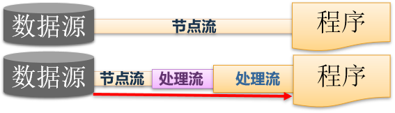

# IO

数据流(Stream)是指数据通信的通道。
java程序中对数据的输入、输出操作是以“流”方式进行的。JDK中提供了各式的“流”类来获取不同种类的数据。


流的分类:

按流向分：
​	输入流：程序可以从中读取数据的流
​	输出流：程序能向其中写入数据的流
按数据传输单位分：
​	字节流：以字节为单位传输数据的流
​	字符流：以字符为单位传输数据的流
按功能分：
​	节点流：用于直接操作目标设备的流
​	处理流：是对一个已存在的流的连接和封装，通过对数据的处理为程序提供更为强大、灵活的读写功能。



# 一. File

File 类  文件/ 目录

用来描述文件和文件夹

文件： 存储一些数据。 区分类型： 通过文件的后缀名

目录： 文件存储的位置

## 1.构造方法

```java
构造方法：

new File(Stirng pathName);
new File(String parent, String child);
new File(File parent, String child);
```

## 2.分隔符

```java
separator  分割符
File类的一个常用属性:public static final String separator　存储了当前系统的路径分隔符
在 UNIX 系统上，此字段的值为 '/'；在 Windows 系统上，它为 '\\'
为了程序的跨平台特性，文件的路径应该用这个属性值来代表。

String pathname = "C:\\pro\\b.jpeg";
String pathName = "C:"+File.separator+"pro"+File.separator+"b.jpeg";
```

## 3.常用方法

```java
常用方法：

getPath()           得到相对路径
getAbsolutePath()     得到绝对路径（ String ）
getAvsoluteFile()       得到绝对路径（ File ）
getParent()             得到父目录(String)
getParentFile()          得到父目录（ File ）
getName()           得到文件名称
getLastmodified()       得到最后一次修改的时间  long
canRead()           是否可读
canWrite()          是否可写
length()            文件的大小
isFile()            判断是否为文件
isDirectory()        判断是否为文件夹
exists()            判断文件是否存在
createNewFile()          创建一个文件
mkdir()                创建一个文件夹
mkdirs()            级联创建文件夹
list()             文件夹中的所有文件和文件夹的名称  String
listFile()          文件中的所有文件和文件夹的名称File的表现形式  File
delete()            删除文件
renameTo(File)          修改文件名称  -- 移到指定位置

对文件的操作：
public boolean createNewFile() //不存在时创建此文件对象所代表的空文件
public boolean delete()　//删除文件。如果是目录必须是空才能删除
public boolean mkdir() 　//创建此抽象路径名指定的目录
public boolean mkdirs()　//创建此抽象路径名指定的目录，包括所有必需但不存在的父目录
public boolean renameTo(File dest)    //重新命名此抽象路径名表示的文件

浏览目录中的文件和子目录：
public String[] list()    //返回此目录中的文件名和目录名的数组
public File[] listFiles()     //返回此目录中的文件和目录的File实例数组
public File[] listFiles(FilenameFilter filter)    //返回此目录中满足指定过滤器的文件和目录
```

示例:

```java
import java.io.File;
public  class FileTest{
    public static void main(String[] args){
        File file = new File(args[0]);
        System.out.println("文件或目录是否存在:" +  file.exists());
        System.out.println("是文件吗:" +  file.isFile());
        System.out.println("是目录吗:" +  file.isDirectory());
        System.out.println("名称:" +  file .getName());
        System.out.println("路径: " + file.getPath());
        System.out.println("绝对路径: " + file.getAbsolutePath());
        System.out.println("最后修改时间:" + file.lastModified());    
        System.out.println("文件大小:" + file.length()+ “ 字节”); 	 	
        ……
    }
}
```

递归遍历文件:

```java
    // 1. level用来记录当前递归的层次
    public static void listChilds(File f, int level) {
        // 生成有层次感的空格
        StringBuffer sb = new StringBuffer("|--");
        for (int i = 0; i < level; i++) {
            sb.insert(0, "|  ");
        }

        File[] childs = f.listFiles();

        // 递归出口
        int length = childs == null ? 0 : childs.length;
        return;

        for (int i = 0; i < length; i++) {
            System.out.println(sb.toString() + childs[i].getName());
            if(childs[i].isDirectory()){
                listChilds(childs[i], level + 1);
            }
        }
    }

	//2.
	public static void main(String[] args) {
		//1, 指定读取的文件路径
		File file = new File("C:" + File.separator + "pro");
		//2, 开始查找
		search(file);
	}

	private static void search(File file) {
		if (file!=null) {
			if (file.isDirectory()) {
				//都是文件夹
				//返回该层级的目录
				File[] files = file.listFiles();
				for(File f: files){
					search(f);
				}
			}else{
				//打印的文件的名称
				System.out.println(file);

			}
		}else{
			System.out.println("玩呢");
		}

	}
```


# 二. IO 流

Input / Output 流（Stream）

## 1. 概念  

​	类比水流。 数据从一个位置， 流向另一个位置。 数据的传输。

## 2. 分类

1. 按流向分 : 以程序为立场

      输入流：  数据进入程序(一般情况读入数据)
      输出流：  数据从程序中出去（保存到本地， 上传数据）

2. 按数据传输单位分 :

```
  Bit （位）， 0,1
  Byte（字节）， 8个位	
  
  字节流：  每次操作的是1个字节
  字符流：  每次操作的是字符  ， 2个字节， 16位  （操作的中文）
```

3. 按功能分 :

      节点流： 直接接触数据源的流
      处理流： 也叫过滤流， 没有直接接触数据， 而是嵌套在别的流之上

## 3. 4大基类（父类）流

	InputStream   字节输入流
	OutputStream  字节输出流
	Reader   	  字符输入流
	Writer        字符的输出流
	
	流的操作步骤
	  1， 确定数据源
	  2， 确定流向， 确定子类
	  3， 操作流
	  4， 关闭流
1. InputStream 读的操作

```java
    public abstract int read() throws IOException
    从输入流中读取数据的下一个字节, 返回读到的字节值.若遇到流的末尾,返回-1

    public int read(byte[] b) throws IOException
    从输入流中读取 b.length 个字节的数据并存储到缓冲区数组b中.
    返回的是实际读到的字节总数(内容的长度)len
    如果读取到末尾, 返回-1

    public int read(byte[] b, int off, int len) throws IOException
    从数组b的off位置开始写入到这个数组中，最多的读取len个
    返回值是实际读取的长度  len
    如果读取到末尾， 返回-1

    public void close() throws IOException
    关闭此输入流并释放与此流关联的所有系统资源

    public int available() throws IOException
    返回此输入流下一个方法调用可以不受阻塞地从此输入流读取（或跳过）的估计字节数

    public skip(long n) throws IOException
    跳过和丢弃此输入流中数据的 n 个字节，返回实现路过的字节数。   
    
    
    	File file  = new File("C:\\pro\\a.jpg");
		InputStream is = new FileInputStream(file);
		File file2  = new File("C:\\pro\\b.jpg");
		OutputStream  os = new FileOutputStream(file);
		//每次读取的内容
		//普通的文件   1024
		//视频和音频   1024*2
		byte[] buffer = new byte[1024];
		//每次读取的长度
		int len = 0;
		int sum = 0;//图片的大小
		while ((len = is.read(buffer))!=-1) {
			sum +=len;
			System.out.println(Arrays.toString(buffer));
            os.write(buffer,0,len);
            os.flush();
		}
		System.out.println(sum);
		is.close();
		os.close();
```

2. OutputStream  写的操作

```java
	保存数据到本地文件中， 如果文件不存在， 输出流会自定创建一个文件， 然后在写出内容
    但是如果目录不存在， 那么会抛出异常

    public abstract void write(int b) throws IOException
    将指定的字节写入此输出流:将参数所表示的内容写出， 该方法执行一次， 表示写出了一个字节

    public void write(byte[] b) throws IOException
    将 b.length 个字节从指定的 byte 数组写入此输出流,全部写出

    public void write(byte[] b, int off, int len) throws IOException
    将指定 byte 数组中从偏移量 off 开始的 len 个字节写入此输出流

    public void flush() throws IOException
    刷新此输出流并强制写出所有缓冲的输出字节

    pulbic void close() throws IOException
    关闭此输出流并释放与此流有关的所有系统资源

    String 类
	字节数组：getBytes()   byte[]
	字符数组：toCharArray()  char[]
```

3.   Reader

```java
  字符流的本质：
    自带一块缓存区的字节流， 尝试去读
    如果遇到一个‘a’ ， 在编码表中找， 如果找到了则输出
    如果遇到一个“国”， 先读取半个， 然后后编码表中找， 如果没有， 先缓存起来
    在读它的另一半， 然后组合在一起， 输出字符
    Writer writer = new FileWriter("C:\\pro\\ccc.txt");
    writer.write("稻花香里说丰年，听取蛙声一片。");
	//因为是字符输出流， 将数据写入到该流的自带缓存区中
    //字符流 必须要刷新或者关闭
    writer.flush();//表示刷新缓存区， 就是将缓存区中的内容， 写入到目标文件中
    writer.close();//关闭流


  字符流:以字符为单位,读入数据
    public int read() throws IOException
    读取单个字符，返回作为整数读取的字符，如果已到达流的末尾返回-1

    public int read(char[] cbuf) throws IOException
    最多读取到的是数组长度的个数， 实际读到的长度，
    是方法的返回值len， 数据存入数组中，读到末尾返回-1

    public abstract int read(char[] cbuf, int off, int len) throws IOException
    最多读取len的长度,实际读入的数量是方法的返回值
    从数组cbuf的off位置开始写入到这个数组中,如果读取到末尾返回-1

    public abstract void close() throws IOException
    关闭该流并释放与之关联的所有资源

    public long skip(long n) throws IOException
    跳过n个字符。


		File file = new File("C:\\pro\\happy.txt");
		Reader reader = new FileReader(file);
		
		//本次读取的内容
		char[] buffer = new char[1024];
		
		//读取的长度
		int len = 0;
		StringBuilder sBuilder = new StringBuilder();
		while ((len = reader.read(buffer))!=-1) {
			sBuilder.append(buffer, 0, len);
		}
		System.out.println(sBuilder.toString());
		reader.close();
```

4. Writer

```java
	字符流:以字符为单位,写出数据
	
    public void write(int c) throws IOException
    写入单个字符
    
    public void write(char[] cbuf) throws IOException
    写入字符数组
    
    public abstract void write(char[] cbuf, int off, int len) throws IOException
    写入字符数组的某一部分
    
    public void write(String str) throws IOException
    写入字符串
    
    public void write(String str, int off, int len) throws IOException
    写字符串的某一部分
    
    public abstract void close() throws IOException
    关闭此流，但要先刷新它
    
    public abstract void flush() throws IOException
    刷新该流的缓冲，将缓冲的数据全写到目的地
    
```


## 4. 处理流

1. 转换流

```java
字节和字符的转换
输入： InputStreamReader(InputStream is)
输出:  OutputStreamWriter(OutputStream os)
    
只有转换流有指定编码的功能
InputStreamReader isr = new InputStreamReader(fis,"UTF-8");    
OutputStreamWriter osw = new OutputStreamWriter(fos, "UTF-8");
    
    public void readFromFile(String filename) {
        BufferedInputStream bufferedInput = null;
        byte[] buffer = new byte[1024];
        try {
            //创建BufferedInputStream 对象
			bufferedInput = new BufferedInputStream(new FileInputStream(filename));
            int bytesRead = 0;
            //从文件中按字节读取内容，到文件尾部时read方法将返回-1
            while ((bytesRead = bufferedInput.read(buffer)) != -1) {
                //将读取的字节转为字符串对象
				String chunk = new String(buffer, 0, bytesRead);
                System.out.print(chunk);
            }
        } catch (FileNotFoundException ex) {
            ex.printStackTrace();
        } catch (IOException ex) {
            ex.printStackTrace();
        } finally {
            //关闭 BufferedInputStream
            try {
                if (bufferedInput != null)
                    bufferedInput.close();
            } catch (IOException ex) {
                ex.printStackTrace();
            }
        }
    }
```

2. 缓存流  -- 提高访问效率 ，  降低访问硬盘的次数

```java
BufferedReader     缓存字符输入流
new BufferedReader( Reader )

BufferedWriter    缓存字符输出流
new BufferedReader( Writer )

BufferedInputStream     缓存字节输入流
read(buffer,0,len);

BufferedOutputStream    缓存字节输出流
```

3. 内存流

```java
ByteArrayOutputStream   将数据存入到内存流中

内存流的本质： 内存流自己会创建一块数组， 该数组用于存储写入的数据，。
该数组的特点： 会随着写入数据的容量自动增加

取出：
A, toByteArray()  -- byte[]
B, toString()  --   String
C, 使用ByteArrayInputStream ， 从内存中一点点取出数据

示例:
	public static void main(String[] args) throws IOException {
		//模拟地址
		String imagePath = "C:\\pro\\a.jpg";
		//1,根据地址获取图片
		FileInputStream fis = new FileInputStream(imagePath);
		//2,创建内存流， 用于向内存中写入数据
		ByteArrayOutputStream bos = new ByteArrayOutputStream();
		//3,开始读取数据
		byte[] buffer  = new byte[1024];
		int len = 0;
		while ((len = fis.read(buffer))!=-1) {
			//4, 将本次读取的内容， 通过内存流， 存入到内存中
			bos.write(buffer, 0, len);
		}
		//到此， 数据就全部读取下来， 并且都保存到内存中
		//5,从内存流中获取所有的数据
		byte[] data = bos.toByteArray();
		//可以显示图片了
		//6, 模拟控件，  写出去
		FileOutputStream fos = new FileOutputStream("C:\\iphone\\image.jpg");
		fos.write(data);
		//7, 关闭流
		fis.close();
		fos.close();
	}
```

4. 对象流

```java
存储对象到本地文件中
将对象转为一系列的二进制编码， 存入到文件中   --- 对象的序列号
将这些这些二进制编码， 转为对象的过程 --- 反序列号

ObjectInputStream     二进制编码，转为对象
ObjectOutputStream    将对象保存到本地文件中， 写出对象

示例:
//1.Person实体类
public class Person implements Serializable{
	//定义序列号
	private static final long serialVersionUID = 1L;
	String name;
	int age;
	static String city;//静态属性， 不能被序列号， 静态属性属于类所有 不是对象,   -- 反序列化 是回不来的
	transient int sex;//transient 该属性不会被序列号
	
	public Person() {
	}

	public Person(String name, int age) {
		super();
		this.name = name;
		this.age = age;
	}
}


//2.把对象保存到本地文件中  
public class Demo14_ObjectStream {
	public static void main(String[] args) throws IOException{
		Person p1 = new Person();
		p1.name = "张三";
		p1.age = 25;
		p1.city = "北京";
		
		Person p2 = new Person();
		p2.name = "李四";
		p2.age = 32;
        
		FileOutputStream fis = null;
		ObjectOutputStream oos  = null;//对象输出流 --- 将对象转成二进制编码， 保存起来
		fis = new FileOutputStream("C:\\pro\\person.txt");
		oos = new ObjectOutputStream(fis);
		
		// java.io.NotSerializableException: com.qf.demo03.Person  
        // 缺少 Person 实现可序列号的接口
		oos.writeObject(p1);
		oos.writeObject(p2);
		oos.flush();
		oos.close();
	}
}


//3.从文件中读取对象
public class Demo15_ObjectStream {
	public static void main(String[] args) throws IOException, ClassNotFoundException{
		FileInputStream fis = new FileInputStream("C:\\pro\\person.txt");
		ObjectInputStream ois = new ObjectInputStream(fis);
        
		Person p1 = (Person) ois.readObject();
		System.out.println(p1.name + ",\t "+ p1.age + ",\t" + p1.city);
		
		Person p2 = (Person) ois.readObject();
		System.out.println(p2.name + ",\t "+ p2.age);
	}
}
```

5. 随机访问流

```java
RandomAccessFile   -- 可以设置光标在文件中的位置

getFilePointer()   获取光标的位置
skipBytes(int n)   跳过n个字节
seek(int n)     设置光标距离文件开头有几个字节

		File file = new File("C:\\pro\\eee.txt");
		RandomAccessFile raf = new RandomAccessFile(file, "rw");//读写
		
		System.out.println(raf.getFilePointer());//当前光标所在的位置
		
		int temp = raf.read();
		System.out.println((char)temp);
		System.out.println(raf.getFilePointer());
		
		raf.skipBytes(3);//向后跳过n个字节  -- 设置光标的位置
		System.out.println(raf.getFilePointer());
		temp = raf.read();
		System.out.println((char)temp);
		
		raf.seek(1);//设置光标的位置， 距离开头的字节
		System.out.println(raf.getFilePointer());
		temp = raf.read();
		System.out.println((char)temp);
```

